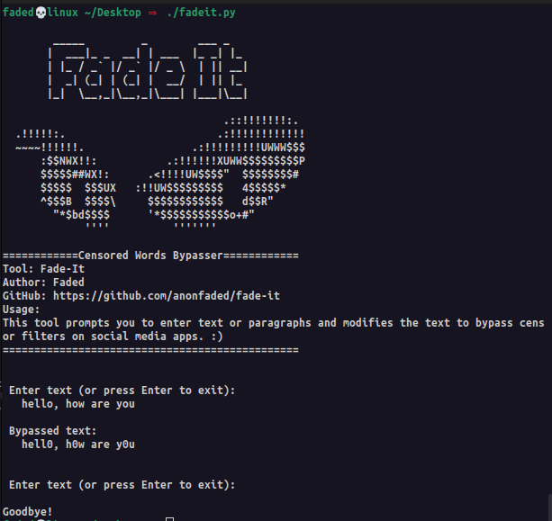

# Fade-It

A tool to bypass censor filters by modifying text.




## Installation

1. **Install Python3**:

   Make sure you have Python 3 installed on your system. If it's not already installed, use the appropriate command for your platform:

   - For Linux:
     ```bash
     sudo apt-get update
     sudo apt-get install python3
     ```

   - For Android (using Termux):

     First download the `termux` app from playstore and use the commands.

     Install Python by running:
     ```bash
     pkg install python3
     ```

   - For Windows:

     You can download Python from the official website: [Python.org](https://www.python.org/downloads/) or use a package manager like [Chocolatey](https://chocolatey.org/):

     ```powershell
     choco install python3
     ```

## **Clone the Repository**:

   Open your terminal or command prompt and clone this repository:

   ```bash
   git clone https://github.com/anonfaded/fade-it.git
   cd fade-it
   ```
   - The first command will clone this repo to your system.
   - The second will change the directory to fade-it where you will run the script.

## **Run the Script**:

Execute the script with:

```bash
python3 fadeit.py
```
or this command:
```bash
./fadeit.py
```

The tool will guide you through the rest.