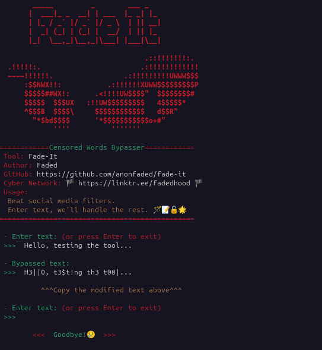

<div align="center">
   
# Fade-It

A Python tool designed to bypass censor filters on social media apps by transforming simple text into special characters.

**For the Android Keyboard APK version, you can check the repository  [FadeBoard](https://github.com/anonfaded/fadeboard).**

[](https://github.com/anonfaded/fade-it/releases/)



</div>

---

## ⬇️ Download

Download the file from the [releases](https://github.com/anonfaded/fade-it/releases/).


## Compatibility 

- Linux
- Android (termux app)
- Windows (command prompt)
- Ios (ish app)
- Mac

## Install Python3

   Make sure you have Python 3 installed on your system. If it's not already installed, use the appropriate command for your platform:

   - For Linux:
     ```bash
     sudo apt-get update
     sudo apt-get install python3
     ```

   - For Android (using Termux):

     First download the `termux` app from playstore and use the commands.

     Install Python by running:
     ```bash
     pkg install python3
     ```

   - For Windows:

     You can download Python from the official website [Python.org](https://www.python.org/downloads/) or use a package manager like [Chocolatey](https://chocolatey.org/).

     ```powershell
     choco install python3
     ```

   - For Apple (ios):

     In ISH app run
     ```bash
     apk add python3
     ```
     Since there is an issue with the app which can't clone directly from github so we will do the steps manually.
     (If the `git clone` command is working then you can skip the manual steps)

     
<details>
  <summary> Click to toggle the steps for ios</summary>
   
   1. Open ISH app.
   2. Open safari browser and open this repository's releases page from this [link](https://github.com/anonfaded/fade-it/releases/).
   3. Download from the `Source code (zip)` button under Assets, and the zip folder will be downloaded in `My Files` of your phone.
   4. Now open `My Files` app and navigate to `downloads` folder, you will find a zip folder named as `fade-it-1.0.0.zip`, long press and `uncompress` it.
     Then copy or move this folder to ish's `root` directory. `ish > root > paste_folder_here`.
   5. Done! Now open the ish app and use command `ls`, you will see a folder on terminal as `fade-it-1.0.0`, now navigate to it by `cd fade-it-1.0.0/` `Tip: use the tab button on keyboard to autocomplete(->)` and do `ls` again, thats the script which we will use.
   6. Now run the script by command: `python3 fadeit.py`
   7. Done.
</details>


## **Clone the Repository**

   Open your terminal or command prompt and clone this repository:

   ```bash
   git clone https://github.com/anonfaded/fade-it.git
   cd fade-it
   ```
   - The first command will clone this repo to your system.
   - The second will change the directory to fade-it where you will run the script.

## **Run the Script**

Give the executable permission by:
```bash
chmod +x fadeit.py
```

Execute the script with:

```bash
python3 fadeit.py
# or
./fadeit.py
# or
py fadeit.py
```

Done! The tool will guide you through the rest.

